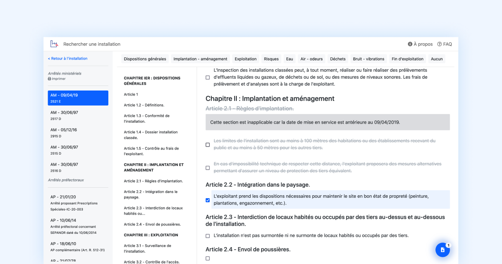

# Envinorma

Envinorma facilite la préparation des inspections en simplifiant l'accès à la réglementation applicables aux industries non nucléaires en France ([les ICPE](https://fr.wikipedia.org/wiki/Installation_class%C3%A9e_pour_la_protection_de_l'environnement)).

Ce projet a été lancé dans le cadre du programme [EIG](https://entrepreneur-interet-general.etalab.gouv.fr/).

Liens utiles :
- [la page du projet](https://entrepreneur-interet-general.etalab.gouv.fr/defis/2020/envinorma.html)
- [la documentation technique](https://envinorma.github.io/)
- [l'url de l'application](http://envinorma.herokuapp.com/).




## Lancer l'application en local

### Télécharger l'application
```
git clone git@github.com:Envinorma/envinorma-web.git
cd envinorma-web
```

### Installer les librairies
```
bundle install
yarn install
```

### Seeder les données et lancer le serveur
```
rails db:create db:migrate db:seed
rails s
```
Vous pouvez maintenant vous rendre sur l'URL `localhost:3000` pour utiliser l'application en local.

### Lancer les tests
```
bundle exec rspec #unit and features tests
rubocop #linter ruby
slim-lint app/views/ #linter slim
```

> Pour mettre en place des "git hooks" afin de lancer ces tests à chaque push, exécuter `$ ./scripts/install-hooks.bash`
