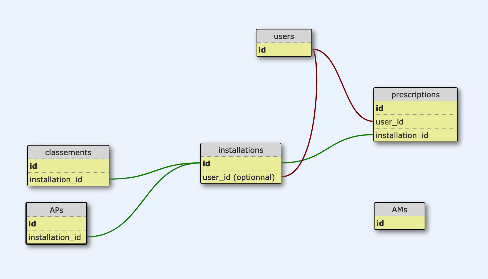

# Envinorma

Envinorma facilite la préparation des inspections en simplifiant l'accès à la réglementation applicables aux industries non nucléaires en France ([les ICPE](https://fr.wikipedia.org/wiki/Installation_class%C3%A9e_pour_la_protection_de_l'environnement)).

Ce projet est réalisé dans le cadre du programme [EIG](https://entrepreneur-interet-general.etalab.gouv.fr/). Pour en savoir plus, vous pouvez consulter [la page du projet](https://entrepreneur-interet-general.etalab.gouv.fr/defis/2020/envinorma.html) ou vous rendre sur [l'application](http://envinorma.herokuapp.com/).


## Lancer l'application en local

### Télécharger l'application
```
git clone git@github.com:Envinorma/envinorma-web.git
cd envinorma-web
```

### Installer les librairies
```
bundle install
yarn install
```

### Seeder les données et lancer le serveur
```
rails db:create db:migrate db:seed
rails s
```
Vous pouvez maintenant vous rendre sur l'URL `localhost:3000` pour utiliser l'application en local.

### Lancer les tests
```
bundle exec rspec #unit and features tests
rubocop #linter ruby
slim-lint app/views/ #linter slim
```

> Si vous souhaitez mettre en place des "git hooks" pour lancer ces tests à chaque push, il vous suffit d'éxécuter `$ ./scripts/install-hooks.bash`

---

## Pour aller plus loin

### Les données
Pour fonctionner l'application nécessite un certains nombres de données externes, liées aux installations et à la règlementation.
Vous trouverez dans [ce dossier](https://github.com/Envinorma/data-tasks) les différentes tâches de préparation de la donnée. Elle est ensuite incorporée dans l'application à l'aide du `DataManager`

```
DataManager.seed_installations_and_associations(true)
#permet de seeder les installations ainsi que leurs classements et arrêtés préfectoraux associés

DataManager.seed_ams
#permet de seeder les arrêtés ministériels
```

> (Aujourd'hui la donnée est simplement supprimée puis recréée - un systême plus fin de mise à jour est en cours).

> On utilise la gem `after_party` pour lancer des tâches au moment du déploiement. ex: lorsque que l'on met en production un nouveau lot d'arrêtés ministériels


> La donnée des tables `installations`, `classements`, `APs` et `AMs` sont seedées à partir de scripts et ne sont pas modifiées directement par l'utilisateur. L'utilisateur peut toutefois dupliquer des installations existantes et modifier leurs classements.

### Le filtre à arrêtés ministériels
Nous avons mis en place un [back-office](https://github.com/Envinorma/back-office) (application en Python) qui permet de paramétrer les arrêtés ministériels selon plusieurs critères : date de mise en service, alinéa de classement… En fonction des paramètres entrés cela génère plusieurs versions pour un seul arrêté ministériel.

> Plus d'informations sur les règles de paramétrisation des arrêtés, sur cette [documentation](https://github.com/Envinorma/envinorma-data/blob/master/envinorma/parametrization/README.md).

Une partie centrale de l'application Envinorma réside donc à retrouver la version correspondante à l'installation sélectionnée par l'utilisateur. Cette tâche est assurée par le module `filter_arretes.rb`.
